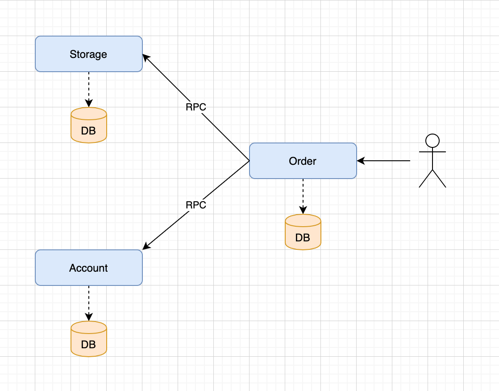

# seata-demo-springcloud
Seata Demo project for Spring Cloud

## 用例
本demo基于springcloud，采用feign直接调用的方式，以微服务的方式实现了用户购买商品的业务逻辑。
整个业务逻辑由3个微服务提供支持：
- 订单服务（order）：根据采购需求创建订单，分布式事务发起者
- 仓储服务（storage）：对给定的商品扣除仓储数量，分布式事务参与者
- 账户服务（account）：从用户账户中扣除余额，分布式事务参与者

## 架构图

## Spring Cloud Alibaba与Spring Cloud版本的对于关系

| Spring Cloud Alibaba | Spring Cloud |
|---|---|
|2.2.1.RELEASE|Hoxton SR3|
|2.1.2.RELEASE|Greenwich SR5|
|2.0.2.RELEASE|Finchley SR4|
